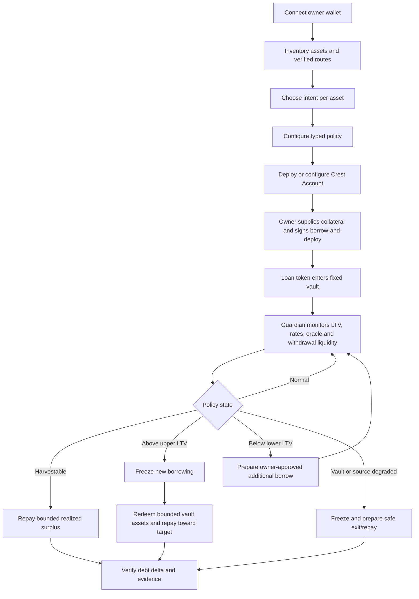

# Crest Product Requirements Document

**Status:** Build-ready revised product specification
**Product:** Crest
**Primary event:** Arbitrum Open House Singapore 2026
**Primary deployment:** Robinhood Chain, subject to live market and vault verification
**Strategy:** [STRATEGY.md](./STRATEGY.md)
**Logo:** [`crest-logo.png`](./crest-logo.png)

## 1. Product decision

> **Crest is a policy-controlled borrowing and debt-repayment account for tokenized equities. The owner keeps exposure to one supported Robinhood Stock Token, borrows through one verified Morpho market, may deploy the loan token into one fixed yield vault, and authorizes Crest Guardian to freeze or reduce debt without giving it permission to increase debt or redirect funds.**

MVP posture: **autonomous downside, consented upside**.

Crest is not a lending market, basket token, universal router, generic trading agent, cross-margin system, or guaranteed self-repaying loan.

### MVP truth

One non-upgradeable Crest Account manages:

- one exact Morpho position;
- one exact collateral token;
- one exact loan token;
- one idle loan-token reserve;
- one exact loan-token yield vault, only if it passes qualification;
- one least-power Crest Guardian.

The owner signs every debt-increasing action. Guardian actions can only freeze or repay the account's own debt.

### Long-term vision

One policy surface can coordinate several independently evaluated Crest Accounts and strategies. Morpho positions remain isolated; Crest never claims protocol-level cross-margin.

## 2. Problem

Tokenized-equity holders can unlock stablecoin liquidity without selling exposure, but three systems drift continuously:

1. collateral price and accrued debt change LTV;
2. borrow and yield rates change net carry;
3. vault withdrawal liquidity can disappear exactly when repayment is needed.

A conventional lending UI opens the position but does not enforce an owner's stricter LTV band, prove that yield is actually available for repayment, or constrain automation to debt-reducing actions.

## 3. Users

### 3.1 Primary: tokenized-equity holder

Wants stablecoin liquidity without selling a supported Stock Token and without granting an agent a general trading key.

### 3.2 Primary: treasury or wealth operator

Needs explicit allocation, LTV, strategy, and automation policy plus a complete evidence trail.

### 3.3 Secondary: risk operator

Needs to know which source triggered an action, what the agent could call, and whether accrued debt actually decreased.

### 3.4 Explicit non-users

- users in jurisdictions where Stock Tokens are unavailable;
- users expecting legal ownership rights in the underlying equity;
- users seeking unbounded leverage, guaranteed yield, or guaranteed liquidation prevention;
- users whose desired collateral market or yield route does not pass runtime verification.

## 4. Verified constraints

- Robinhood Chain is an Arbitrum-based EVM chain; current official docs identify mainnet chain ID `4663`.
- Stock Tokens provide tokenized economic exposure and are jurisdiction-restricted.
- Robinhood lifecycle APIs are advisory, read-only sources; they cannot replace the Morpho oracle.
- A Morpho market is isolated and identified by loan token, collateral token, oracle, IRM, and LLTV.
- Creating a market does not create lender liquidity.
- Morpho collateral earns no protocol yield. Loan-asset suppliers earn through supply shares.
- An ERC-4626 share quote is not guaranteed withdrawal liquidity; current `maxWithdraw`/`maxRedeem` and simulation matter.
- Borrow APY, vault APY, incentives, fees, and liquidity are variable.
- A trading-halt signal does not prove Stock Token transfers or Morpho liquidation stop.

These constraints are product behavior, not footnotes.

## 5. Jobs to be done

1. “Show which wallet assets have a real executable route and why the others do not.”
2. “Let me keep one asset untouched, use one as collateral, and deploy only eligible stablecoin to yield.”
3. “Show the exact debt, collateral, vault liquidity, and net-carry calculation before I sign.”
4. “Keep my position inside a stricter LTV band without letting the agent borrow more in MVP.”
5. “Use realized yield or bounded strategy liquidity to repay debt and prove the result.”
6. “If the position has more capacity, ask me before increasing debt.”
7. “Keep repayment and exit available when a data source, vault, or market is degraded.”

## 6. Product principles

1. **Autonomous downside, consented upside.** Guardian may reduce debt; owner creates debt.
2. **Protocol truth first.** Exact onchain market, position, oracle, vault, and receipts outrank APIs and projections.
3. **No fake collateral yield.** Morpho collateral APY is zero.
4. **One verified route first.** One market and one vault before routing or optimization.
5. **Fixed destinations.** Guardian cannot choose a receiver, venue, market, or calldata.
6. **Liquidity is risk.** Only currently withdrawable and simulated vault assets count toward automated repayment.
7. **Offchain signals only tighten.** Stale, missing, or conflicting data never grants capacity.
8. **Realized before projected.** Debt-repayment evidence is primary; annualized APY is secondary.
9. **Exit stays open.** Borrowing freeze never blocks safe repayment or owner exit.

## 7. Asset intents

| Intent | Meaning | MVP |
|---|---|---:|
| `KEEP` | Asset remains in owner wallet; Crest only displays it | Yes |
| `PROTECT_AND_BORROW` | Asset becomes collateral in one qualified Morpho market | One route |
| `EARN_STABLE` | Configured loan token enters one qualified stablecoin vault | One route |
| `EARN_ASSET` | Non-stable asset enters its own verified yield venue without borrowing | Post-MVP B |
| `UNSUPPORTED` | No verified route; no transaction prepared | Yes |

The same Stock Token cannot simultaneously remain Morpho collateral and be deposited into another yield protocol. A future receipt-token-as-collateral route requires its own market, oracle, and liquidity verification.

## 8. Route qualification

### 8.1 Morpho market gate

Before `PROTECT_AND_BORROW` is executable:

1. verify chain ID and Morpho deployment bytecode;
2. verify canonical collateral and loan token addresses, code, and decimals;
3. derive and match exact market ID from all five parameters;
4. verify oracle scale, freshness, pause, and sequencer rules;
5. verify current LLTV, IRM, supply, borrow, and available loan liquidity;
6. execute supply → borrow → repay → withdraw on a pinned fork;
7. record sources, block, time, and code hashes.

### 8.2 Yield-vault gate

Before `EARN_STABLE` is executable:

1. verify vault chain, address, bytecode, interface, and underlying asset;
2. require vault asset to equal the configured Morpho loan token;
3. test deposit, preview, withdrawal, redemption, rounding, and loss behavior;
4. inspect `maxWithdraw`/`maxRedeem`, caps, pause, fees, and queues;
5. document curator/manager authority and downstream allocations;
6. distinguish base yield, incentives, and displayed promotional APY;
7. execute owner borrow-and-deploy plus Guardian strategy-repay on a pinned fork;
8. prove debt decreased and no value reached Guardian.

The Robinhood Earn/Steakhouse USDG route is a candidate, not a dependency claim, until this gate passes.

## 9. End-to-end MVP flow



## 10. MVP policy

Natural-language example:

> “Use only the verified NVDA/USDG market and the verified USDG vault. Target 35% LTV, start protection at 42%, and treat 50% as critical while remaining below Morpho LLTV. Never exceed 5,000 USDG debt. Keep 500 USDG idle reserve. Require at least 150 bps estimated net spread for new owner borrowing. Guardian may repay at most 1,000 USDG per action and may never borrow.”

Validated typed shape:

```json
{
  "version": 2,
  "account": "0x1111111111111111111111111111111111111111",
  "market": {
    "id": "0x...",
    "collateralToken": "0x...",
    "loanToken": "0x...",
    "maxCollateralAssets": "3000000000000000000000",
    "debtCeilingAssets": "5000000000"
  },
  "strategy": {
    "vault": "0x...",
    "asset": "0x...",
    "maxStrategyAssets": "5000000000",
    "minNetSpreadBps": 150
  },
  "reserve": {
    "floorAssets": "500000000",
    "maxRepayPerActionAssets": "1000000000"
  },
  "ltv": {
    "lowerWad": "300000000000000000",
    "targetWad": "350000000000000000",
    "upperWad": "420000000000000000",
    "criticalWad": "500000000000000000"
  },
  "triggers": {
    "freezeOnOracleDegraded": true,
    "freezeOnVaultDegraded": true,
    "freezeOnLifecycleDegraded": true
  },
  "guardian": "0x2222222222222222222222222222222222222222"
}
```

Addresses and amounts are schema examples, not deployment claims.

### Enforced onchain

- exact Morpho market and fixed vault;
- collateral, debt, strategy-deposit, reserve-floor, and per-action repayment caps;
- ordered LTV threshold configuration;
- borrowing freeze;
- owner versus Guardian permission boundary;
- strategy redemption receiver and repayment destination.

### Evaluated offchain

- current and stressed policy health;
- borrow APY, vault APY, incentives, fees, and estimated net carry;
- currently withdrawable vault liquidity;
- oracle, sequencer, vault, and source freshness;
- Stock Token lifecycle signals;
- recommended owner borrow or Guardian repayment amount.

Offchain evaluation cannot bypass onchain caps or grant Guardian debt authority.

## 11. Risk and economics

### 11.1 LTV and health

For collateral value $C$, accrued debt $D$, market LLTV $L_m$, and stricter policy LTV $L_p$:

$$
LTV = \\frac{D}{C}
$$

$$
H_m = \\frac{C \\times L_m}{D}
\\qquad
H_p = \\frac{C \\times L_p}{D}
$$

When $D=0$, health is `no_debt`, not numeric infinity.

Policy ordering:

```text
lowerLTV < targetLTV < upperLTV < criticalLTV < Morpho LLTV
```

### 11.2 Downside repayment

$$
D_{target} = C \\times targetLTV
$$

$$
R = \\min(
\\max(0, D-D_{target}),
W_{vault},
R_{reserve},
R_{action},
D
)
$$

$W_{vault}$ uses current withdrawable assets and a successful simulation. Quoted vault TVL or `previewRedeem` alone is insufficient.

### 11.3 Upside capacity

$$
B = \\max(0, D_{target}-D)
$$

MVP presents $B$ as an owner transaction. Post-MVP A may automate it only inside an unexpired owner-signed envelope.

### 11.4 Net carry

For strategy assets $Y$, borrow APY $r_b$, vault APY $r_y$, realized incentives $R_i$, and annualized fees/costs $F$:

$$
Carry_{annual} = Y r_y + R_i - D r_b - F
$$

$$
Spread = \\frac{Carry_{annual}}{Y}
$$

Display annual estimates separately from realized vault earnings and realized debt reduction. A small debt denominator must not produce a promotional giant negative APY without the absolute stablecoin numerator.

### 11.5 Conservative capacity

New owner-borrow capacity is the minimum of:

- remaining onchain debt ceiling;
- remaining capacity under target/policy LTV;
- usable Morpho loan liquidity;
- remaining strategy deposit cap;
- zero if required market/oracle/vault/rate inputs are degraded;
- zero if estimated spread is below policy minimum.

This is an internal owner recommendation. It does not change Morpho LLTV.

## 12. Crest Guardian

### 12.1 Guardian states

| State | Trigger | Automated behavior |
|---|---|---|
| `NORMAL` | Inside band, sources fresh | None |
| `HARVESTABLE` | Realized surplus exceeds configured/gas threshold | Repay bounded surplus |
| `UPSIZE_AVAILABLE` | LTV below lower band and spread passes | Owner recommendation only |
| `PROTECT` | LTV above upper band | Freeze, then bounded repay |
| `EXIT_YIELD` | Spread/vault health violates policy | Freeze; redeem toward reserve/debt when safe |
| `CRITICAL` | LTV at/above critical | Use bounded withdrawable strategy principal to repay; alert |
| `DEGRADED` | Required source unknown/stale/conflicting | Capacity zero; freeze; only freshly simulated debt reduction |

### 12.2 Guardian authority

Guardian may only:

1. set borrowing frozen to `true`;
2. repay from idle reserve above the signed floor;
3. redeem from the fixed vault to the Crest Account and repay its own Morpho debt.

Guardian cannot unfreeze, borrow, withdraw to a receiver, transfer, approve arbitrary spenders, swap, sell collateral, choose a market/vault, or change policy.

## 13. Functional requirements

### Discovery and intent

- **CR-F-001:** Inventory MUST display wallet assets without implying a route.
- **CR-F-002:** Every asset MUST have one explicit intent and support reason.
- **CR-F-003:** Executable market identity MUST use exact verified MarketParams, not ticker.
- **CR-F-004:** Executable vault identity MUST use exact verified chain/address/asset/code.
- **CR-F-005:** Market and vault MUST be reverified immediately before deployment/demo.

### Policy and owner actions

- **CR-F-010:** Natural language MAY draft; only schema-valid typed policy can prepare calldata.
- **CR-F-011:** LTV thresholds MUST be ordered and below Morpho LLTV.
- **CR-F-012:** Owner MUST see addresses, amounts, rates, floors, caps, and Guardian permissions before signing.
- **CR-F-013:** Initial and additional borrowing MUST be owner-only in MVP.
- **CR-F-014:** `borrowAndDeploy` MUST accrue/read debt, enforce caps, borrow to the account, and deposit only into the fixed vault.
- **CR-F-015:** Configuration changes MUST emit complete versioned events.

### Monitoring and economics

- **CR-F-020:** Assessments MUST reference exact block/timestamp-scoped Morpho, oracle, vault, and rate inputs.
- **CR-F-021:** Accrued current debt and withdrawal liquidity MUST be refreshed before action.
- **CR-F-022:** Morpho collateral yield MUST display as zero.
- **CR-F-023:** Borrow APY, vault APY, incentives, and fees MUST remain separate fields.
- **CR-F-024:** Projected carry and realized debt repayment MUST never share one label.
- **CR-F-025:** Stale, paused, illiquid, conflicting, or unavailable input MUST not increase capacity.
- **CR-F-026:** Stock Token multiplier MUST not be applied twice.

### Guardian automation

- **CR-F-030:** Guardian MAY freeze but MUST NOT unfreeze.
- **CR-F-031:** Reserve repayment MUST be bounded by request, per-action cap, available reserve, and current debt.
- **CR-F-032:** Strategy repayment MUST be bounded by request, per-action cap, current withdrawable assets, policy floor, and current debt.
- **CR-F-033:** Strategy redemption receiver MUST be the Crest Account; repayment beneficiary MUST be the same account.
- **CR-F-034:** Guardian MUST NOT create debt in MVP.
- **CR-F-035:** Every run MUST use an idempotency key, fresh simulation, canonical receipt, and postcondition checks.
- **CR-F-036:** Success requires accrued debt decreased and all configured reserve/strategy constraints held.
- **CR-F-037:** Insufficient withdrawal liquidity MUST freeze/alert, not retry blindly or sell collateral.

### UX and evidence

- **CR-F-040:** UI MUST show Morpho LLTV, current LTV, target band, and policy health separately.
- **CR-F-041:** UI MUST show vault assets, currently withdrawable assets, and reserve separately.
- **CR-F-042:** Every APY MUST show source, timestamp, denominator, and projected/realized status.
- **CR-F-043:** Every intervention MUST show trigger, policy version, function, requested/capped/actual amount, receipt, and debt before/after.
- **CR-F-044:** Live, forked, simulated, cached, projected, and illustrative evidence MUST be distinct.
- **CR-F-045:** No copy may promise guaranteed yield, repayment, or liquidation prevention.

## 14. Non-functional requirements

### Safety

- Guardian compromise can only freeze or spend permitted account-owned stablecoin/vault shares toward the account's own debt.
- Contract has no arbitrary call, delegatecall, generic approval, operator receiver, or upgradeable proxy.
- Vault loss, withdrawal delay, and spread inversion are first-class failure states.

### Reliability

- Duplicate triggers submit at most one active action.
- Reorgs invalidate dependent observations and unsent actions.
- Automation restarts from persisted trigger/receipt state.
- Failed repayment leaves borrowing frozen and requires fresh assessment.

### Numeric correctness

- Token amounts, shares, WAD values, and prices use integer/bigint math.
- APY units and compounding conventions are explicit.
- Debt uses current accrued Morpho share conversion.
- Vault assets use current share conversion plus withdrawal limits.

### Privacy/compliance

- No owner or Guardian private key enters the web/API database.
- Jurisdiction and Stock Token economic-rights disclosure precede onboarding.
- Crest provides no legal, tax, investment, yield, or liquidation guarantee.

## 15. Roadmap

### MVP — protected yield loop

- one verified market and one verified stablecoin vault;
- wallet inventory and per-asset intent;
- owner-signed supply plus borrow-and-deploy;
- Guardian freeze, reserve repay, and fixed-strategy repay;
- transparent net carry and realized debt-delta evidence.

### Post-MVP A — bounded target-LTV automation

Add an EIP-712 owner-signed borrow envelope containing:

- exact account, market, and vault;
- maximum additional debt and maximum action/day;
- expiry and cooldown;
- lower/target/upper LTV;
- minimum policy health and net spread;
- nonce and immediate revocation.

Guardian may borrow only when LTV is below the lower band, all inputs are fresh, and funds can only land in the fixed vault. This requires a new audited contract version.

### Post-MVP B — verified portfolio allocation

- one Crest Account per isolated market under one dashboard;
- two or more independently qualified stablecoin strategies;
- verified `EARN_ASSET` routes for assets that support them;
- owner priority between repay, reserve, and earnings withdrawal;
- risk-adjusted ranking by net spread, withdrawal liquidity, cap, and protocol concentration;
- optional fixed swap adapter only after oracle/slippage/MEV review.

Post-MVP B still does not create cross-margin or universal asset support.

## 16. MVP out of scope

- autonomous additional borrowing;
- dynamic best-yield routing;
- arbitrary strategy or receiver selection;
- Stock Token collateral supply yield;
- collateral sale, swap, flash loan, or unwind;
- basket token or composited collateral;
- new Morpho market or liquidity incentives;
- cross-stablecoin conversion unless native to the verified route;
- FHE, Orbit L3, social/shared agents, or Stylus.

## 17. Success metrics

### Product

- 100% of Crest-originated borrows are owner-authorized and pass onchain controls.
- 100% of Guardian value-moving calls target own-debt repayment.
- Every claimed repayment proves accrued debt decreased.
- No degraded input creates positive new-borrow capacity.
- No unsupported market/vault is advertised as executable.
- Projected carry and realized debt repayment remain distinguishable.

### Hackathon

- one market and one vault pass qualification or the reserve-only fallback is labeled clearly;
- one small owner borrow-and-deploy succeeds;
- one forbidden borrow is blocked;
- one downside trigger freezes and executes bounded strategy repayment;
- receipt/post-state prove debt decreased and health improved;
- upside capacity appears as owner approval, demonstrating Crest's differentiation.

## 18. Demo script

1. Inventory a wallet and assign `KEEP`, `PROTECT_AND_BORROW`, and unsupported intents.
2. Open the exact market/vault verification drawers.
3. Configure target band, debt cap, net-spread floor, reserve, and repayment cap.
4. Owner supplies collateral and signs a small borrow-and-deploy.
5. Show debt, vault shares, withdrawable liquidity, rates, and estimated carry.
6. Show a forbidden over-cap/frozen borrow reverting.
7. Trigger a labeled collateral-drop or spread-degradation scenario.
8. Guardian freezes, redeems a bounded vault amount, and repays Morpho.
9. Prove debt delta and policy-health improvement from canonical state.
10. Show an upside recommendation waiting for owner approval.
11. Show Post-MVP A signed envelope and Post-MVP B portfolio allocation as unavailable roadmap.

## 19. Failure conditions and fallback

The full yield-loop pitch is blocked if no Stock Token-backed Morpho market or same-loan-token vault has usable liquidity.

Fallback:

- keep the same Crest Account and market safety controls;
- use idle reserve repayment only;
- show the failed vault qualification reason;
- label forked execution honestly;
- never use a mock yield source as live APY or self-repayment evidence.

## 20. Business model

- Free single-account dashboard and core contracts.
- Paid multi-account monitoring, Guardian operations, alerts, evidence export, and policy templates.
- Later performance fee only on realized strategy earnings after accounting is auditable; never on projected APY.
- Treasury/wealth integrations and governance workflows.

No token is required.

## 21. Related documents

- [Product strategy](./STRATEGY.md)
- [Agent context](./CONTEXT.md)
- [Architecture](./technical/ARCHITECTURE.md)
- [Smart contracts](./technical/SMART-CONTRACT.md)
- [Integrations](./technical/INTEGRATIONS.md)
- [ERD](./technical/ERD.md)
- [Tech stack](./technical/TECH-STACK.md)
- [Design system](./DESIGN-SYSTEMS.md)
- [Build plan](./BUILD-PLAN.md)
- [Installation](./technical/INSTALLATION.md)

## 22. Primary sources

- [Hobba founder demo](https://www.loom.com/share/5de3ab70886e49f2a3bf2efded4e6909)
- [Hobba — Borrow Better](https://hobba.io/)
- [Arbitrum developer docs](https://docs.arbitrum.io/)
- [Robinhood Chain](https://docs.robinhood.com/chain/)
- [Robinhood Stock Tokens](https://docs.robinhood.com/chain/stock-tokens/)
- [Robinhood Stock Token APIs](https://docs.robinhood.com/chain/stock-token-apis/)
- [Robinhood Earn](https://robinhood.com/us/en/crypto/earn/)
- [Morpho market mechanics](https://docs.morpho.org/developers/borrow/concepts/market-mechanics/)
- [Morpho collateral, LTV, and health](https://docs.morpho.org/developers/borrow/concepts/ltv/)
- [Morpho core contract API](https://docs.morpho.org/developers/contracts/morpho/)
