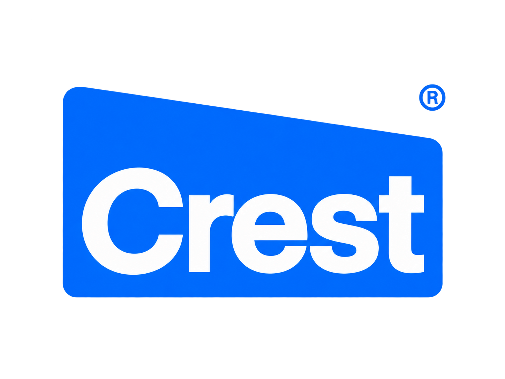
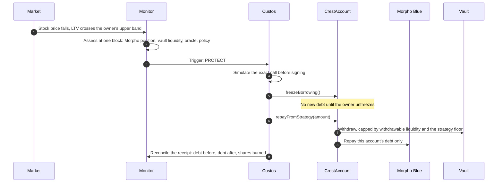
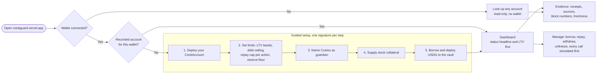
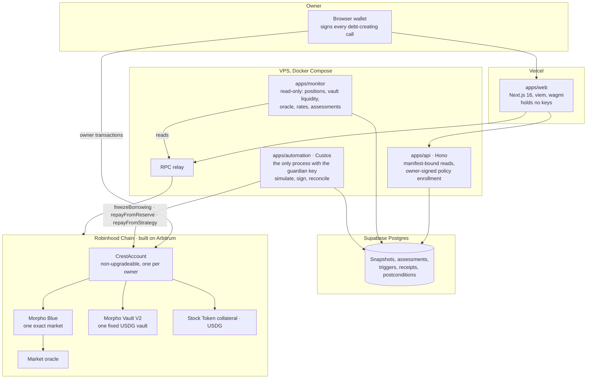

<p align="center">
  
</p>

<h3 align="center">Borrow against your tokenized stock, with a guardian that can only pay the debt down.</h3>

<p align="center">
  Crest is a borrowing account for Robinhood Stock Tokens on Robinhood Chain, built on Arbitrum.<br />
  You set the limits and sign every new loan. Custos, the account's guardian, may freeze new borrowing or repay your debt from your own funds. It has no way to borrow, move, or sell.
</p>

<p align="center">
  <a href="https://crestguard.vercel.app"><b>Live app</b></a> ·
  <a href="https://crestguard.vercel.app/account?account=0xaD8A3272c6E68cF819fe1E3b2aEFD0f8Fd5b2c75">Watch the demo account</a> ·
  <a href="#onchain-evidence">Onchain evidence</a> ·
  <a href="#architecture">Architecture</a> ·
  <a href="docs/PRD.md">PRD</a>
</p>

<p align="center">
  
  
  
  
  
</p>

---

## The problem

Tokenized stocks let people borrow stablecoins without selling their shares. The hard part comes later, when the share price drops at 3 a.m. and the loan drifts toward liquidation.

Today there are two options, and both are bad:

1. **Watch it yourself.** Miss one bad night and a liquidator sells your collateral at a penalty.
2. **Hand a bot your key.** Now the bot can borrow more, swap, or send funds anywhere. You traded liquidation risk for key risk.

## What Crest does

Crest takes a third path. Your position lives in one non-upgradeable smart account, `CrestAccount`, and the contract itself decides who may do what.

| | Owner (you) | Custos (the guardian) |
|---|---|---|
| Create debt | Yes, and only you | Never |
| Change limits, unfreeze, change guardian | Yes | Never |
| Withdraw collateral or stablecoins | Yes | Never |
| Freeze new borrowing | Yes | `freezeBorrowing()` |
| Repay this account's debt from idle funds | Yes | `repayFromReserve(uint256)`, capped per action |
| Repay this account's debt from the vault | Yes | `repayFromStrategy(uint256)`, capped and bounded by withdrawable liquidity |
| Pick a market, vault, receiver, swap, or arbitrary call | Fixed in the contract | Not possible |

Those three functions are the guardian's whole interface. A stolen guardian key can cause, at worst, a nuisance freeze or an early repayment of your own debt. It cannot extract value. That claim is enforced by the contract's call graph and its invariant tests, not by an API allowlist.

## One bad day, handled



This is not a mock. Steps 4 to 9 ran on Robinhood Chain Testnet, with no owner signature in the loop. See [Onchain evidence](#onchain-evidence).

## With Custos, or without

| Situation | Borrowing on Morpho alone | A bot holding your key | Crest with Custos |
|---|---|---|---|
| Price drops while you sleep | Liquidation, with a penalty on your collateral | Bot can react, and can also do anything else | Custos freezes borrowing and pays debt down within your caps |
| Who can create debt | You | You and the bot | Only you |
| Where repaid funds can go | n/a | Anywhere the key can send | Morpho, for this account's debt only |
| If the automation key leaks | n/a | Attacker can drain the account | Attacker can freeze or repay your own debt early |
| Stale or missing data | n/a | Depends on the bot | Can only tighten: Custos waits, the owner reviews |
| Proof of what happened | Block explorer | Bot logs | Simulated call, canonical receipt, debt delta reconciled per action |

## How someone uses it



Returning owners land directly on their position. First-time visitors get the five steps above, each with a plain explanation and a review sheet before the wallet opens.

## Architecture



**Design rules that shaped it**

- **Separate reading from signing.** The monitor reads and decides; Custos signs. Compromising a data source does not hand anyone the guardian key, and only `custos.env` holds that key.
- **One exact route.** A Morpho market is fixed by loan token, collateral, oracle, rate model, and LLTV. Crest binds to one market and one vault, verified by address, code hash, and block in a chain-tagged [deployment manifest](config/deployment-manifest.46630.json).
- **Withdrawable liquidity, not TVL.** Strategy repayment is bounded by what the vault can actually pay out right now, not by shares or quoted assets.
- **Bad input only tightens.** Stale, paused, conflicting, or missing data can block an action or freeze borrowing. It can never loosen a limit.
- **Facts stay separate.** Projected carry, realized vault earnings, and actual debt reduction are three different numbers and are never blended.

| Path | What lives there |
|---|---|
| `contracts/src/CrestAccount.sol` | The account: authority, caps, floors, repayment, withdrawal |
| `contracts/src/libraries/VaultV2Liquidity.sol` | Vault V2 withdrawable-liquidity math |
| `contracts/test/` | Unit, fuzz, invariant, and pinned-fork proofs |
| `apps/web` | Landing page, guided setup, dashboard, read-only look-up |
| `apps/api` | Recorded accounts, positions, owner-signed policy enrollment |
| `apps/monitor` | Assessments and triggers from onchain state |
| `apps/automation` | Custos: claim trigger, simulate, sign, reconcile |
| `packages/risk`, `packages/policy` | Pure LTV, capacity, carry math and the strict policy compiler |
| `config/deployment-manifest*.json` | The verified route registry, one file per chain |
| `docs/` | PRD, strategy, architecture, contract spec, design system, lessons |

## Onchain evidence

Everything below is public on Robinhood Chain Testnet (chain ID `46630`). Explorer: [explorer.testnet.chain.robinhood.com](https://explorer.testnet.chain.robinhood.com).

### Accounts and roles

| Role | Address |
|---|---|
| Demo CrestAccount | [`0xaD8A3272c6E68cF819fe1E3b2aEFD0f8Fd5b2c75`](https://explorer.testnet.chain.robinhood.com/address/0xaD8A3272c6E68cF819fe1E3b2aEFD0f8Fd5b2c75) · source verified on [Sourcify](https://sourcify.dev/server/v2/contract/46630/0xaD8A3272c6E68cF819fe1E3b2aEFD0f8Fd5b2c75) |
| Owner | [`0x712683F374Cd524F6336E87D577Fc39d1102930A`](https://explorer.testnet.chain.robinhood.com/address/0x712683F374Cd524F6336E87D577Fc39d1102930A) |
| Custos guardian (hosted, current) | [`0xBBF6Ec4a16Babf20A1a14D8D8DEf7e3f6442A4dC`](https://explorer.testnet.chain.robinhood.com/address/0xBBF6Ec4a16Babf20A1a14D8D8DEf7e3f6442A4dC) |
| Custos guardian (first canary) | [`0x4fd1139714C571Fc49BF26fFaA0375Adb137f271`](https://explorer.testnet.chain.robinhood.com/address/0x4fd1139714C571Fc49BF26fFaA0375Adb137f271) |

### Route

| Component | Address |
|---|---|
| Morpho Blue | [`0x99607363652591ffF66BA23EF8D91563CA48038b`](https://explorer.testnet.chain.robinhood.com/address/0x99607363652591ffF66BA23EF8D91563CA48038b) |
| Market ID | `0x165f9db8f5e1d9982a35dfaadb3f944cf747970c8f819f16f10105f5c7eb6e04` (LLTV 86%) |
| Loan token, USDG (test) | [`0x7E955252E15c84f5768B83c41a71F9eba181802F`](https://explorer.testnet.chain.robinhood.com/address/0x7E955252E15c84f5768B83c41a71F9eba181802F) |
| Collateral, TSLA (faucet test token) | [`0xC9f9c86933092BbbfFF3CCb4b105A4A94bf3Bd4E`](https://explorer.testnet.chain.robinhood.com/address/0xC9f9c86933092BbbfFF3CCb4b105A4A94bf3Bd4E) |
| Vault, Morpho Vault V2 | [`0x70F514670d554f3388e15eBce2c7Aa37307A21Bc`](https://explorer.testnet.chain.robinhood.com/address/0x70F514670d554f3388e15eBce2c7Aa37307A21Bc) |
| Oracle | [`0x79DA01DB22808E3A7397B788F171a7647b1bEf8f`](https://explorer.testnet.chain.robinhood.com/address/0x79DA01DB22808E3A7397B788F171a7647b1bEf8f) |

### The lifecycle, transaction by transaction

| # | Step | Signed by | Block | Transaction |
|---|---|---|---|---|
| 1 | Deploy CrestAccount | Owner | 127605219 | [`0x8afd…6c6f`](https://explorer.testnet.chain.robinhood.com/tx/0x8afd0f21a3f2aab2d745ed8d8ded1c8aba9e5dec7c59109c022435df74606c6f) |
| 2 | Configure policy, nonce 1 | Owner | 127614423 | [`0xe594…6195`](https://explorer.testnet.chain.robinhood.com/tx/0xe594609325c1df0d7bc8114f01a347ad354c88f0e2d08174031cbe5d46bd6195) |
| 3 | Supply 1 TSLA as collateral | Owner | 127615533 | [`0x3cca…604e`](https://explorer.testnet.chain.robinhood.com/tx/0x3cca3bfe4568f3c243be878a67ae4d88bcf1940b7b64d223b8ccac72573d604e) |
| 4 | Borrow 10 USDG and deploy to the vault | Owner | 127615997 | [`0x07b8…24f2`](https://explorer.testnet.chain.robinhood.com/tx/0x07b808f91572920fe15e19f7354bcc82067c6e7358fa572108a24649920924f2) |
| 5 | **Freeze borrowing** | **Custos** | 127616213 | [`0x9792…df02`](https://explorer.testnet.chain.robinhood.com/tx/0x97928bd278806869575157dc7dc515c368af602b29eb33c581c71aefa86edf02) |
| 6 | Owner tightens LTV bands, nonce 2 | Owner | 127633398 | [`0x3cdf…1e2e`](https://explorer.testnet.chain.robinhood.com/tx/0x3cdfa83efab9ea004985146d855b8e507815a3223478dce891475abe9cda1e2e) |
| 7 | **Repay 6.421094 USDG from the vault** | **Custos** | 127634675 | [`0xe512…e90a`](https://explorer.testnet.chain.robinhood.com/tx/0xe512f21cdaf7b08eb80fb5de8c8fcd9e3221e4be5bf853621c08655dd46ce90a) |
| 8 | Repay the remaining 3.578953 USDG | Owner | 127635409 | [`0x6be9…93c8`](https://explorer.testnet.chain.robinhood.com/tx/0x6be9c55eb5a38d2e883e31d8b0134ceb419a5e65f1bbfb39d82dcd303b4593c8) |
| 9 | Withdraw strategy funds | Owner | 127635515 | [`0x0b70…53a0`](https://explorer.testnet.chain.robinhood.com/tx/0x0b700f95bd0b659e455bced7d273e61158a70879a8247200ddc6bad0e14153a0) |
| 10 | Rotate to the hosted guardian, nonce 3 | Owner | 127689896 | [`0xd949…c08e`](https://explorer.testnet.chain.robinhood.com/tx/0xd949537c63e6179b8b4b98eea2b8077b3df0ed4294ba56e27b691816cb63c08e) |
| 11 | **Freeze borrowing, unattended from the VPS** | **Custos** | 127691278 | [`0x86da…971d`](https://explorer.testnet.chain.robinhood.com/tx/0x86daefef76289df87bb66f2e43107d8425f1575a9a56744272e53f3c3f77971d) |

Step 7 is the headline: debt went from **10.000047 to 3.578953 USDG** in one guardian transaction, funded from the account's own vault shares, reconciled against the receipt. Full records: [`docs/evidence/canary-live-46630.json`](docs/evidence/canary-live-46630.json) and [`docs/evidence/hosted-guardian-46630.json`](docs/evidence/hosted-guardian-46630.json).

The mainnet route (chain `4663`) is registered as reviewed evidence in [`config/deployment-manifest.json`](config/deployment-manifest.json) and proven by a pinned-fork lifecycle test at block 65483446. Runtime signing on mainnet is disabled.

## Where Crest stands

Crest is in active development. This is an honest snapshot, not a launch announcement.

| Area | Status |
|---|---|
| `CrestAccount` contract | Deployed on testnet, source verified, 74 Foundry tests including fuzz, invariant, and pinned-fork |
| Custos guardian | Running unattended on a VPS against the demo account |
| Web app | Live at [crestguard.vercel.app](https://crestguard.vercel.app): landing, guided setup, dashboard, read-only look-up |
| Testnet route | **SANDBOX.** No primary source publishes a qualifiable testnet route, so this one uses a faucet TSLA token, a public mock price feed anyone can move, a fixed-rate mock rate model, and an idle-only vault. Every page that touches it says so. |
| Mainnet route | Reviewed and fork-proven; live signing intentionally off |
| Security audit | Not yet. Required before any real funds |

The demo account is frozen right now, by design: its USDG price feed and stock registry entry cannot be read on testnet, so Custos keeps borrowing frozen until the owner reviews. Unclear data only ever tightens.

## Roadmap

| Stage | What ships |
|---|---|
| **Now: protected loop** | One market, one vault, owner-signed borrowing, Custos freeze and repay, full receipt trail |
| **Next: audit and mainnet** | External audit of `CrestAccount`, a qualified Robinhood Chain mainnet market, real Stock Token collateral |
| **Then: bounded upside** | Owner-signed borrow envelopes (amount, expiry, daily cap, minimum health, revocable at any time) so Custos can rebalance up without a general borrow permission |
| **Later: portfolio** | Several isolated accounts under one dashboard, more qualified vaults, owner-defined priority between repaying and earning |

Crest will keep building past this hackathon. The next milestones are the audit, a mainnet market with real Stock Tokens, and a small founding team covering smart-contract security and growth.

## Run it locally

Requirements: Node `24.21.0`, pnpm `12.4.1`, Foundry `1.8.1`. Exact pins live in [`docs/technical/TECH-STACK.md`](docs/technical/TECH-STACK.md).

```bash
pnpm install
pnpm verify                      # generate, typecheck, and test every package
cd contracts && forge test       # unit, fuzz, and invariant proofs
pnpm fork:test                   # pinned-fork lifecycle proof
pnpm --filter @crest/web dev     # web app on http://localhost:3000
```

Open the app at `localhost`, not `127.0.0.1`; the dev server does not hydrate from an origin it does not recognise. Full setup, including the local database and the VPS deployment, is in [`docs/technical/INSTALLATION.md`](docs/technical/INSTALLATION.md).

## Built with AI, piloted by a human

Crest was built by one person, [Dylansius Putra Prasetio](https://dylansiusputra.vercel.app), working with AI coding agents. We want to be clear about who did what.

**The human decided.** Product scope, the authority model, which risks to accept, the SANDBOX decision, every design approval, and every merge. Every owner transaction in the evidence table was signed by the human in his own wallet. No agent ever held the owner key.

**The agents executed.** They wrote and refactored code, ran tests and fork proofs, drafted documentation, and checked onchain state, always under explicit instructions and review.

**How the agents were instructed.** The guardrails are checked into this repository, so anyone can see exactly what the agents were told:

- [`AGENTS.md`](AGENTS.md) is the operating contract: the invariants no change may break, the documents each change must update, and the rule that planned or simulated behavior is never presented as live.
- [`docs/BUILD-PLAN.md`](docs/BUILD-PLAN.md) is the ordered task list with acceptance checks per task.
- `.agents/skills/` holds project skills for contract, proof, and frontend work.
- [`docs/LESSONS.md`](docs/LESSONS.md) records every verified mistake and the rule it produced, so the same error is not repeated.

AI output was treated like any other untrusted input: a claim counted only after a test, a fork proof, or a canonical receipt confirmed it.

## Disclaimer

Crest is a hackathon project in development and has not been audited. The testnet deployment uses test tokens with no monetary value. Stock Tokens are tokenized debt securities that provide economic exposure, not legal ownership of the underlying shares, and they are not available in every jurisdiction. Nothing here is financial advice.

<p align="center">
  <br />
  <sub>Built for Arbitrum Open House 2026 · Robinhood Chain</sub>
</p>
