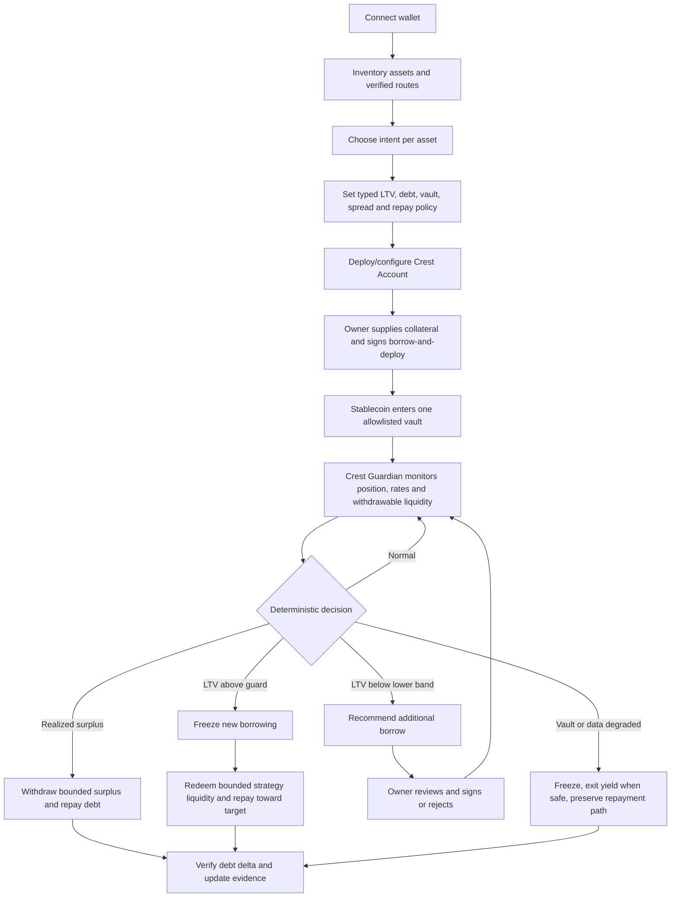

# Crest Product Strategy

**Decision:** keep Crest as a user-facing borrowing product, not a generic lifecycle API or basket issuer.  
**Core promise:** keep exposure to a supported Robinhood Stock Token, borrow a stablecoin through one verified Morpho market, put eligible stablecoin liquidity to work, and let a least-power agent use that liquidity to reduce debt before liquidation risk compounds.  
**Safety posture:** autonomous downside, consented upside.

## 1. What the Hobba demo proves

The reviewed [Hobba founder demo](https://www.loom.com/share/5de3ab70886e49f2a3bf2efded4e6909) shows a coherent three-part product:

1. collateral is placed in a lending venue and can earn supply yield;
2. borrowed USDC is deployed into a separate yield strategy;
3. the Sonnar engine keeps LTV near a target band by borrowing more when collateral appreciates and repaying from strategy liquidity when collateral falls.

The demo uses a `57%–63%` deadband around a `60%` target. It also shows why an extreme negative “loan APY” can be misleading: a small debt denominator can turn modest dollar earnings into a very large annualized percentage. Hobba's current public site confirms its broader model: route across Solana lenders, generate yield from otherwise idle collateral, harvest earnings toward debt, and automatically deleverage.

This is useful evidence, not a blueprint to copy.

## 2. The constraint that changes Crest

Morpho collateral does **not** earn protocol yield. A Stock Token supplied as collateral to one Morpho market remains price exposure, but it does not receive Morpho supply shares or lending APY. Morpho suppliers earn yield on the **loan asset**; collateral does not.

Therefore Crest cannot honestly copy “collateral keeps compounding” for a Stock Token-backed Morpho position. Crest's productive capital is the borrowed stablecoin, not the collateral.

Crest's economic loop is:

```text
supported Stock Token collateral
→ owner-approved Morpho stablecoin borrow
→ exact allowlisted stablecoin yield vault
→ realized yield or protected strategy liquidity
→ debt repayment
```

If no yield vault passes the qualification gate, Crest falls back to the existing reserve-funded protection loop. It does not fabricate APY.

## 3. Differentiation

Crest is not “Hobba on Robinhood Chain.”

| Dimension | Hobba demo | Crest decision |
|---|---|---|
| Collateral | SOL/cbBTC routed through Solana lending venues | One runtime-verified Robinhood Stock Token-backed Morpho market |
| Collateral yield | Lending supply yield | No Morpho collateral yield; state this explicitly |
| Yield capital | Additional borrowed USDC and venue yield | Owner-approved stablecoin borrow deployed only to one allowlisted vault |
| Upside rebalance | Agent borrows more toward target LTV | MVP only recommends; owner signs. Bounded signed automation is Post-MVP A |
| Downside rebalance | Agent pulls strategy funds and repays | Agent may redeem from one fixed vault and repay only the account's own debt |
| Control model | Strategy/risk engine | Typed onchain policy, fixed destinations, no arbitrary calls, full evidence trail |
| Stock lifecycle | Not central | Advisory input that can tighten policy; not the headline product |
| User choice | Deposit/borrow/manage | Per-asset intent: keep, protect-and-borrow, or earn-only when a verified route exists |

The defensible product sentence is:

> **Crest turns one supported tokenized-equity position into policy-controlled liquidity: the owner chooses the debt, an allowlisted vault works the stablecoin, and Crest Guardian can only reduce risk unless the owner has explicitly authorized more debt.**

## 4. Product principles

1. **Autonomous downside, consented upside.** Debt-reducing actions may be automated. Debt-increasing actions require the owner in MVP.
2. **No fake collateral yield.** Morpho collateral APY is `0`; Stock Token price/dividend mechanics are not relabeled as lending yield.
3. **One real route first.** One collateral market and one stablecoin vault must pass runtime verification before the UI calls them executable.
4. **Fixed destinations.** The agent cannot choose arbitrary markets, vaults, swaps, receivers, or calldata.
5. **Liquidity is part of risk.** Vault shares are not treated as immediately repayable unless `maxWithdraw`/`maxRedeem`, simulation, and current liquidity support the amount.
6. **Policy before optimization.** A higher APY never overrides LTV, debt, reserve, exposure, freshness, or loss limits.
7. **Realized before projected.** Show realized debt repayment in dollars before annualized projections.
8. **Exit stays open.** A freeze blocks new debt, not owner repayment, vault exit, or safe debt reduction.

## 5. Canonical asset intents

After connecting a wallet, Crest inventories balances but does not pretend every asset has a route.

| Intent | Asset movement | MVP support |
|---|---|---|
| `KEEP` | Asset remains in the owner wallet | Yes; read-only display |
| `PROTECT_AND_BORROW` | Supported collateral enters Crest Account and one verified Morpho market | Yes; one route |
| `EARN_STABLE` | Configured loan token enters one verified stablecoin vault | Yes, only when the vault gate passes |
| `EARN_ASSET` | The selected non-stable asset enters its own approved yield venue without borrowing | Post-MVP B; per-asset verification required |
| `UNSUPPORTED` | No movement | Yes; visible reason |

A Stock Token cannot be both Morpho collateral and independently deployed to another yield venue at the same time unless a future protocol accepts the yield receipt as collateral. Crest does not assume that integration exists.

## 6. MVP flow



### MVP executable scope

- one non-upgradeable Crest Account;
- one exact Morpho market;
- one exact loan token, expected to be USDG only if the chosen market proves it;
- one exact ERC-4626-compatible stablecoin vault or equivalent adapter after verification;
- owner-only `borrowAndDeploy`;
- owner-only strategy withdrawal and configuration;
- Crest Guardian can freeze, repay from idle reserve, and repay from the fixed strategy;
- no operator-selected receiver, venue, swap, collateral sale, or generic execution;
- no autonomous additional borrowing.

USDC is not an automatic alternative. A USDG/USDC conversion adds a swap, price, slippage, and venue boundary and is out of MVP unless the selected Morpho market and yield vault use USDC natively.

## 7. Crest Guardian

`Crest Guardian` is the canonical role name; it can later receive a separate brand name without changing permissions.

### Inputs

- exact Morpho market and accrued position state;
- configured Stock Token oracle state;
- current debt and collateral value;
- vault share value, `maxWithdraw`/`maxRedeem`, and simulation result;
- current borrow APY and vault APY with timestamp/source;
- configured reserve and strategy balances;
- Robinhood lifecycle signals as advisory tightening inputs;
- active policy nonce and thresholds.

### States

| State | Meaning | Allowed automated action |
|---|---|---|
| `NORMAL` | Inside policy band; sources fresh | None |
| `HARVESTABLE` | Realized strategy surplus exceeds repayment and gas threshold | Repay bounded surplus |
| `UPSIZE_AVAILABLE` | LTV below lower band and spread is acceptable | Recommendation only in MVP |
| `PROTECT` | LTV above upper guard | Freeze, then repay from reserve/strategy |
| `EXIT_YIELD` | Net spread or vault health violates policy | Freeze and move strategy liquidity toward reserve/debt |
| `CRITICAL` | Near stricter emergency threshold | Use bounded withdrawable strategy principal to repay; alert owner |
| `DEGRADED` | Required source stale, conflicting, paused, or unavailable | Capacity zero; freeze; only freshly simulated debt reduction |

The agent never says “safe.” It reports the exact state, evidence, available action, and unresolved risk.

## 8. LTV control

For collateral value $C$ and accrued debt $D$:

$$
LTV = \frac{D}{C}
$$

Policy defines:

```text
lowerLTV < targetLTV < upperLTV < criticalLTV < Morpho LLTV
```

Debt required to return to target:

$$
D_{target} = C \times targetLTV
$$

Bounded downside repayment:

$$
R = \min\left(
\max(0, D - D_{target}),
W_{vault},
R_{reserve},
R_{action},
D
\right)
$$

Where $W_{vault}$ is currently withdrawable strategy liquidity, not quoted vault TVL, and $R_{reserve}$ is reserve above its protected floor.

Potential upside borrow:

$$
B = \max(0, D_{target} - D)
$$

In MVP, $B$ is a recommendation and owner transaction. In Post-MVP A it may execute only inside an unexpired owner-signed envelope.

## 9. Yield and debt-repayment accounting

Let:

- $D$ = current accrued debt;
- $Y$ = stablecoin assets actually deployed to the yield strategy;
- $r_b$ = current borrow APY;
- $r_y$ = current vault APY after vault fees where observable;
- $R_i$ = realized incentives;
- $F$ = protocol, execution, and gas costs over the period.

Estimated annual net carry:

$$
Carry_{annual} = Y \times r_y + R_i - D \times r_b - F
$$

Estimated net spread on deployed stablecoin:

$$
Spread = \frac{Carry_{annual}}{Y}
$$

Realized debt-repayment rate over elapsed fraction of a year $t$:

$$
RepayRate_{realized} = \frac{DebtRepaid_{strategy}}{D_{start} \times t}
$$

The dashboard must show:

1. borrow APY;
2. vault APY and source timestamp;
3. estimated net carry in stablecoin per year;
4. realized strategy earnings;
5. realized debt repaid;
6. current withdrawable strategy liquidity;
7. fees and incentives separately;
8. an illustrative time-to-repay only when assumptions are explicit.

Never present a giant negative “loan APY” without the absolute dollar numerator and debt denominator. Never state that debt “pays itself” unless onchain debt has actually decreased.

## 10. Vault qualification gate

A candidate vault is executable only after all checks pass:

1. exact chain, asset, vault address, bytecode, and interface verified;
2. vault asset equals the configured Morpho loan token;
3. deposits, withdrawals, previews, rounding, and share accounting tested;
4. `maxWithdraw`/`maxRedeem` behavior measured under live and forked state;
5. current strategy allocations and curator/management authority documented;
6. fees, rewards, and APY sources separated;
7. withdrawal queue, caps, pause, loss, and insolvency behavior documented;
8. atomic owner borrow-and-deploy succeeds on a pinned fork;
9. Guardian strategy-repay succeeds and reduces Morpho debt;
10. emergency exit and partial-liquidity failure paths tested.

The public Robinhood Earn/Steakhouse USDG route is a candidate, not an approved dependency until its exact current vault deployment and behavior pass this gate.

## 11. Contract authority

### Owner

May configure policy, supply collateral, borrow, deploy stablecoin to the fixed vault, withdraw strategy assets, repay, withdraw, freeze/unfreeze, and revoke Guardian.

### Crest Guardian

May only:

- set borrowing freeze to `true`;
- repay the account's own Morpho debt from reserve;
- redeem from the configured vault directly into the account and repay the account's own Morpho debt.

It cannot borrow, unfreeze, change policy, choose a vault, transfer to a receiver, swap, sell collateral, or call arbitrary targets.

This is the central differentiation: the agent is useful under stress without receiving a general trading key.

## 12. Roadmap

### MVP — protected yield loop

- one verified Stock Token/Morpho market;
- one verified stablecoin vault;
- per-asset intent screen with unsupported reasons;
- owner-signed initial borrow-and-deploy;
- automated freeze, surplus repayment, and downside repayment;
- transparent LTV, net carry, vault liquidity, and realized debt-delta evidence.

### Post-MVP A — bounded target-LTV automation

Adds upside rebalancing without a general borrow permission:

- owner-signed EIP-712 borrow envelope;
- exact market/vault, maximum additional debt, expiry, cooldown, daily cap, minimum health, and minimum net spread;
- borrowed funds can only land in the configured vault;
- Guardian borrows toward target only below the lower band and only while every envelope condition holds;
- owner can revoke immediately;
- full action simulation, receipt, and debt/vault postconditions.

This reproduces the useful part of Hobba's deadband while preserving Crest's constrained-authority design.

### Post-MVP B — verified portfolio allocation

- one account per isolated Morpho market under one dashboard;
- two or more independently qualified stablecoin strategies;
- `EARN_ASSET` for assets with real approved vaults, without pretending they are collateral simultaneously;
- owner-defined priority between repay, stablecoin reserve, and earnings withdrawal;
- risk-adjusted route ranking based on net spread, withdrawable liquidity, caps, and protocol concentration;
- optional specific swap adapter only after oracle/slippage/MEV review;
- no claim of protocol-level cross-margin.

### Later, not precommitted

- audited collateral sale/unwind;
- multi-chain execution;
- new collateral markets or incentive programs;
- institution-specific compliance workflows.

These remain separate product decisions, not dormant MVP code.

## 13. Demo narrative

1. Connect a wallet holding one supported Stock Token, USDG, and unsupported assets.
2. Choose `PROTECT_AND_BORROW` for the supported token; keep another token in-wallet; show why a third has no verified route.
3. Configure target/upper/critical LTV, debt ceiling, minimum net spread, reserve floor, and per-action repay cap.
4. Owner signs one small collateral supply and `borrowAndDeploy` transaction.
5. Show exact Morpho debt, fixed vault shares, withdrawable assets, borrow APY, vault APY, and estimated carry.
6. Advance or inject a clearly labeled fork scenario where collateral falls or the vault spread deteriorates.
7. Crest Guardian freezes new borrowing, withdraws a bounded amount from the configured vault, and repays Morpho.
8. Show canonical receipts and prove debt decreased and policy health improved.
9. Show the upside case as an owner approval recommendation, not a fake autonomous MVP action.
10. Show Post-MVP A signed envelope as the next capability.

## 14. Claims discipline

Use:

- “Keep tokenized-equity exposure while borrowing stablecoin liquidity.”
- “Yield can be directed toward debt repayment.”
- “Crest Guardian automatically reduces debt within signed limits.”
- “Additional borrowing requires owner approval in MVP.”
- “Estimated net carry is variable and can become negative.”

Never use:

- “Liquidation-proof.”
- “Guaranteed self-repaying loan.”
- “Collateral earns Morpho yield.”
- “Negative APY is guaranteed.”
- “The agent always finds the best yield.”
- “Every Stock Token is supported.”
- “Trading halts stop liquidations.”

## 15. Sources

- [Hobba founder demo](https://www.loom.com/share/5de3ab70886e49f2a3bf2efded4e6909)
- [Hobba — Borrow Better](https://hobba.io/)
- [Morpho market mechanics](https://docs.morpho.org/developers/borrow/concepts/market-mechanics/)
- [Morpho collateral, LTV, and health](https://docs.morpho.org/developers/borrow/concepts/ltv/)
- [Robinhood Earn](https://robinhood.com/us/en/crypto/earn/)
- [Robinhood Chain](https://docs.robinhood.com/chain/)
- [Robinhood Stock Tokens](https://docs.robinhood.com/chain/stock-tokens/)
- [Robinhood Stock Token APIs](https://docs.robinhood.com/chain/stock-token-apis/)
