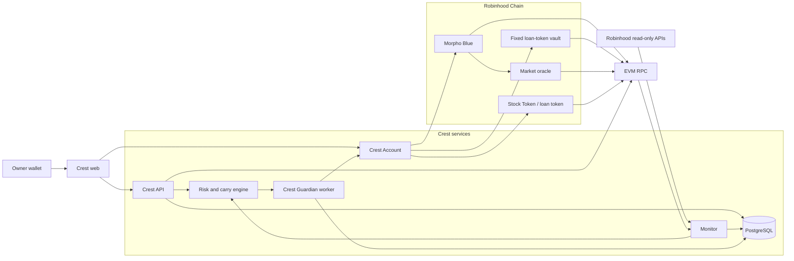
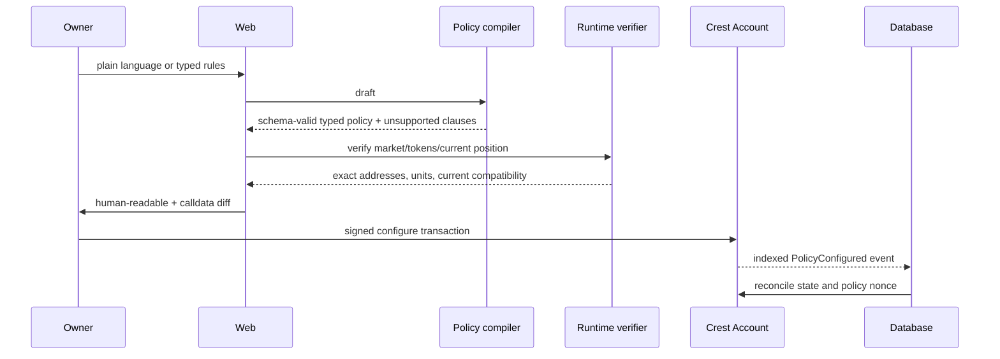
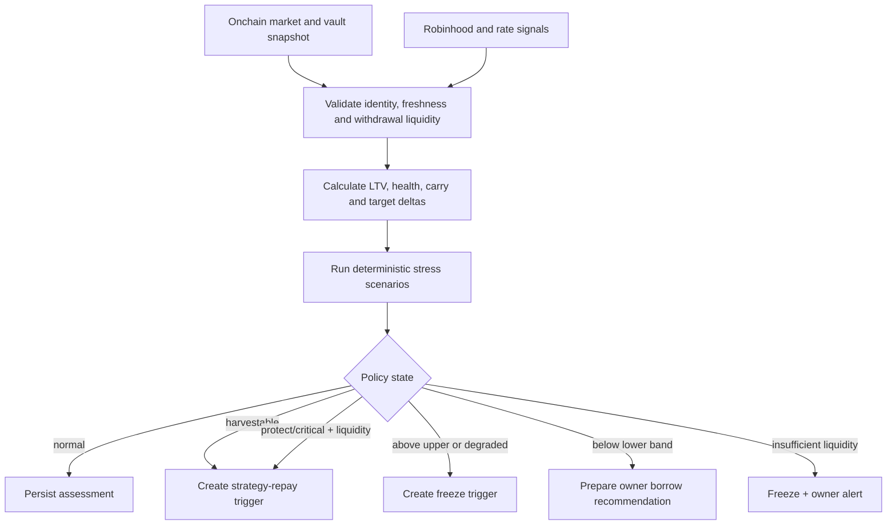
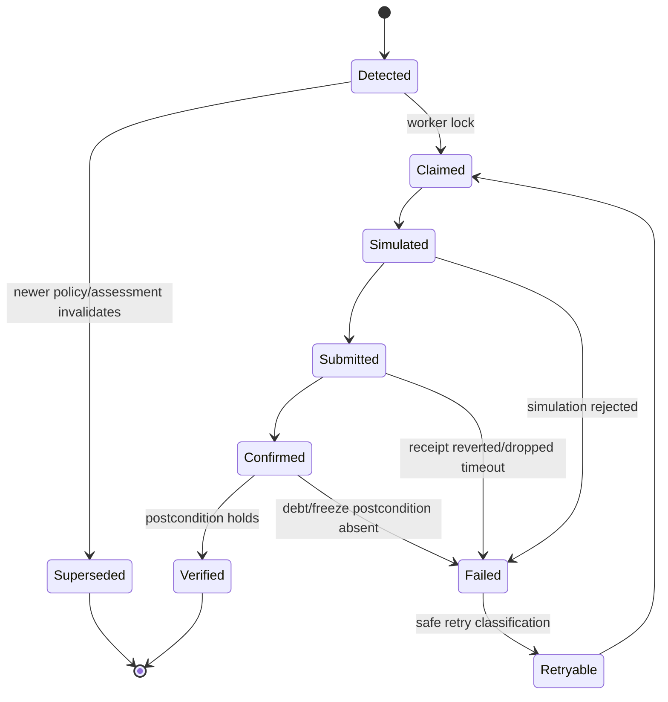
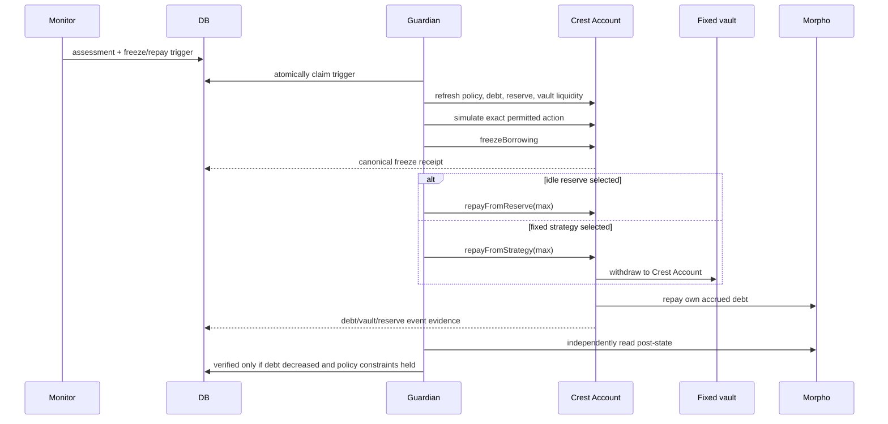

# Crest Architecture

**Architecture style:** policy-controlled account plus deterministic Guardian
**Canonical requirements:** [PRD](../PRD.md)  
**Contract authority:** [SMART-CONTRACT](./SMART-CONTRACT.md)

## 1. Architectural claim

Crest layers a stricter owner policy and one fixed loan-token yield strategy over one real isolated Morpho position. It does not change Morpho parameters, make collateral earn interest, combine collateral, or create liquidity.

Safety comes from asymmetry:

- owner alone creates debt or withdraws value;
- Crest Account enforces exact market, vault, caps, floors, and fixed repayment destinations;
- deterministic services calculate LTV, net carry, withdrawal liquidity, and bounded actions;
- Robinhood lifecycle data and offchain rates can tighten behavior but never grant capacity;
- Crest Guardian can freeze or reduce own debt, never borrow in MVP;
- unsupported routes stay visible rather than being approximated.

## 2. System context



## 3. Deployable units

| Unit | Responsibility | Explicitly forbidden |
|---|---|---|
| `apps/web` | Asset intents, route verification, owner transactions, LTV/carry/debt evidence | Holding keys, presenting projections as realized |
| `apps/api` | Versioned read/config APIs and typed orchestration | Calling Guardian methods directly |
| `apps/monitor` | Read market, position, vault, rates, and lifecycle; create assessments/triggers | Signing, changing policy, or selecting arbitrary routes |
| `apps/automation` | Claim trigger, simulate, sign only freeze/own-debt repayment, reconcile | Borrowing, generic calls, swaps, withdrawals to receivers |
| `packages/risk` | Pure LTV, health, capacity, carry, withdrawal, and action calculations | Provider/database access |
| `packages/policy` | Schema, optional NL draft, compiler, configuration diff | Choosing market/vault/thresholds autonomously |
| `packages/robinhood` | REST adapters and lifecycle freshness | Onchain price or permission authority |
| `packages/morpho` | Market identity/state/actions | Hiding isolated-market constraints |
| `packages/vault` | Fixed-vault identity, shares/assets, withdrawals, and simulation | Dynamic routing or promotional APY |
| `packages/chain` | RPC/oracle/token/account reads and simulation | Business policy |
| `packages/db` | Durable observations, versions, triggers, receipts, postconditions | Source-of-truth contract policy |
| `contracts` | `CrestAccount`, fixed-vault boundary, and tests | Arbitrary execution, Guardian borrowing, swaps, collateral sales |

Monitor and automation are separate processes even if they share a deployment initially. Read-provider compromise must not automatically equal signer compromise.

## 4. Trust boundaries

### Onchain enforceable

- configured Morpho market and fixed vault identity;
- collateral, accrued-debt, and strategy-deposit caps;
- reserve/strategy floors and per-action repayment cap;
- ordered LTV policy values below Morpho LLTV;
- borrowing freeze;
- strategy redemption receiver and own-debt repayment beneficiary;
- owner/Guardian permissions.

### Offchain deterministic

- Morpho health, current LTV, policy health, and target-band deltas;
- borrow APY, vault APY, incentives, fees, and net carry;
- currently withdrawable vault liquidity and simulation result;
- conservative owner-borrow capacity;
- oracle/sequencer/vault/rate freshness;
- Stock Token lifecycle aggregation;
- action idempotency and postcondition verification.

### Advisory/untrusted

- Robinhood REST metadata, bid/ask, halt, and corporate-action responses;
- offchain APY/reward sources;
- natural language and display token metadata;
- third-party provider availability.

Advisory data can reduce capacity, freeze, exit yield, or alert. It cannot enable a route, raise a cap, unfreeze, create debt, or price collateral onchain.

## 5. Policy lifecycle



The database marks a policy active only after the corresponding event is canonical. A rejected/pending transaction never becomes active policy.

## 6. Position lifecycle

Owner flow:

```text
inventory wallet assets
→ choose KEEP / PROTECT_AND_BORROW / EARN_STABLE / UNSUPPORTED
→ configure verified market, fixed vault, LTV band, caps, floors, and Guardian
→ supply collateral
→ owner signs borrowAndDeploy
→ monitor debt, LTV, carry, and withdrawable strategy liquidity
→ Guardian may freeze/repay
→ owner approves any additional borrow or withdrawal
```

The Crest Account owns the Morpho position and fixed-vault shares. Wallet assets marked `KEEP` do not contribute to enforceable capacity. Morpho collateral remains non-yielding.

## 7. Monitoring pipeline

### 7.1 Onchain observation

- Crest Account configuration, frozen state, and policy nonce;
- configured token balances and vault share balance;
- Morpho `MarketParams`, market totals, position shares/collateral, and accrued debt;
- exact market-oracle value/freshness inputs, and the oracle's composition relative to its feeds and `uiMultiplier`;
- Stock Token multiplier and `oraclePaused()` where applicable;
- vault `asset`, bytecode, liquidity adapter and data, share conversion, accounting allocations and caps, gates, and fees (Vault V2 has no pause switch and returns zero from every `max*` function, so neither is read);
- borrow/vault rates with source and timestamp;
- chain head freshness, the only sequencer liveness signal available (Robinhood Chain has no Chainlink uptime feed);
- current market and strategy liquidity.

Where reads cannot be made at one block, record every block and downgrade the assessment if skew exceeds the configured budget.

Every adapter in `packages/{chain,morpho,vault,rates,robinhood}` returns an `Observation<T>` (`@crest/domain`): the value, its provenance (onchain block number/hash/timestamp, or HTTP URL with fetch, provider generation, documented cache expiry, and indexed block), and reason codes. Status is derived: no value is `unknown`, any reason is `degraded`, only a reason-free value is `normal`. Downstream code reads status and reasons; it never re-labels them.

### 7.2 Robinhood observation

Collect:

- canonical deployment metadata;
- current/pending multiplier and effective time;
- underlying bid/ask context;
- `isTradingHalt`;
- processed corporate actions.

Store response source timestamp, fetch time, endpoint/cache semantics, and stable IDs. Do not multiply an already multiplier-adjusted onchain feed again.

### 7.3 Assessment



A trigger records the exact assessment and policy version. Recalculation with new data creates a new assessment; it does not mutate the old one.

## 8. Trigger state machine



Freeze and repayment use separate triggers/transactions unless one audited account method safely combines redemption and repayment. Freeze first is observable; every repayment then uses fresh state.

Idempotency key:

```text
keccak256(chainId, crestAccount, policyNonce, assessmentId, actionKind)
```

Database has one active run per key. Before submission, worker checks onchain state again; a stale trigger may become `superseded` rather than sending.

## 9. Automation signer

The Guardian key:

- is held only by the automation process/secret manager;
- has minimal native gas;
- is authorized only in explicitly allowlisted Crest Accounts;
- can call only `freezeBorrowing()`, `repayFromReserve(uint256)`, and `repayFromStrategy(uint256)` by contract design;
- cannot borrow, unfreeze, choose a receiver/venue, transfer, swap, sell collateral, or change policy;
- can be revoked by owner.

MVP may use one isolated hot Guardian key because its onchain authority is debt-reducing and non-extractive. Production signing infrastructure is added only when operations require it.

## 10. Guardian repayment execution



If repayment fails, borrowing remains frozen after a confirmed freeze. Retries require a new assessment and fresh simulation; partial vault liquidity is a normal bounded outcome, not permission to sell collateral.

## 11. Risk engine

Pure interface:

```ts
type RiskInput = {
  policy: { compiled: CompiledPolicy; nonce: bigint };
  head: Observation<PinnedBlock>;
  account: Observation<AccountState>;
  market: Observation<MarketSnapshot>;
  position: Observation<PositionSnapshot>;
  oracle: { marketPrice: Observation<bigint>; collateralFeed: Observation<FeedRound>; loanFeed: Observation<FeedRound> };
  vault: Observation<VaultSnapshot>;
  strategy: Observation<VaultPosition>;
  rates: RateInputs;
  lifecycle: LifecycleAssessment;
  strategyCostBasisAssets: bigint | null;
  scenarios: ScenarioSet;
};

function assessPosition(input: RiskInput): RiskAssessment;
function planGuardianAction(input: ActionInput): GuardianAction | null;
```

Rules:

- token amounts, shares, prices, rates, and health use bigint/rational values with explicit scales;
- no-debt is a tagged state;
- Morpho collateral yield is always zero;
- projected carry and realized debt repayment are distinct types; only a surplus over the event-reconciled strategy cost basis can become a harvest;
- stale/paused/conflicting/illiquid input is `degraded`; the engine re-applies the policy's own freshness budgets, requires every onchain input at the pinned block (`block_skew`), and checks account, market, vault, feed, and policy-nonce identity;
- Morpho's oracle value drives LTV, health, and capacity; Crest's feed-only value is disclosed beside it, and a gap above `maxOracleDivergenceBps` or with no known composition is `oracle_divergence`;
- degraded input sets owner-borrow capacity to zero and may trigger freeze/exit; each degraded oracle, vault, or lifecycle source freezes only when its policy trigger is on, while head, account, market, and position always do;
- Guardian repayment uses only current withdrawable/simulated assets;
- scenarios are adverse by schema and cannot increase capacity;
- all outputs cite inputs and stable reason codes, and carry the engine version, input hash, policy nonce and hash, and scenario set version.

## 12. Capacity and action planner

MVP owner-borrow capacity is the minimum of:

- remaining Crest accrued-debt ceiling;
- capacity to policy target LTV, valued with Morpho's oracle;
- usable Morpho loan-token liquidity;
- remaining Crest strategy cap;
- remaining fixed-vault deposit room under every absolute and relative cap on the liquidity adapter's ids (Vault V2 `maxDeposit` always returns zero, and a configured deposit gate counts as no room);
- zero when borrowing is frozen, net spread is below policy floor, rates cannot be netted, or any required source is degraded, including `oracle_divergence`, `block_skew`, and a policy-nonce `conflict`.

Repayment capacity is separately bounded by current debt, per-action cap, idle reserve above floor, and currently withdrawable strategy assets above the strategy floor plus one vault share's value of rounding. A repayment is planned only from the account's own reads at the pinned block under the policy nonce the contract holds; a stale, skewed, foreign, drifted, or superseded source leaves only a freeze. Both owner-borrow debt rooms hold back one Morpho borrow share's value for share rounding, and a strategy that cannot currently withdraw what it holds is degraded input.

The planner never uses wallet assets outside the exact market, never treats quoted vault TVL as withdrawable, and never sends additional-borrow output to Guardian in MVP.

## 13. Data consistency and reorgs

- Onchain observations include block number/hash.
- Policy becomes active after configured confirmation depth.
- A reorg invalidates observations, assessments, and unsent triggers depending on orphaned blocks.
- Submitted receipts on orphaned blocks return to reconciliation until canonical confirmation.
- Robinhood REST responses are offchain facts and are not “reorged”; they retain fetch/source timestamps and can be superseded.
- Automation rechecks canonical onchain state immediately before signing.

## 14. Failure modes

| Failure | Conservative behavior |
|---|---|
| Robinhood API unavailable/stale | Lifecycle degraded; owner-borrow capacity zero; freeze if policy requires |
| Rate source stale/conflicts | No new borrow recommendation; preserve debt-reducing actions |
| RPC stale/disagrees | Stop preparation; allow only freshly simulated freeze/repay |
| Oracle paused/stale | Capacity zero; freeze when the policy's oracle trigger is on; no REST price substitute |
| Sequencer degraded | No uptime feed exists on Robinhood Chain; a head older than budget is `head_lag`; freeze and alert |
| Morpho loan liquidity disappears | No new borrow; monitor current debt |
| Vault APY falls below floor | Below the policy spread: no new borrow. Below the borrow rate (negative marginal spread): EXIT_YIELD, freeze, then repay from the strategy |
| Vault withdrawal constrained | Count only current withdrawable amount; partial repay then alert |
| Vault share loss | Recalculate actual assets; no projected-profit claim; freeze/owner review |
| Guardian key unavailable | Alert owner; onchain caps and owner controls remain |
| Guardian key compromised | Attacker can freeze/repay own debt only; owner revokes |
| Repay reverts or debt unchanged | Keep frozen, refresh, classify; no blind loop |
| Corporate action changes multiplier | Reconcile token/oracle exactly; never double-adjust |

## 15. Observability

Structured fields:

`requestId`, `chainId`, `account`, `marketId`, `policyNonce`, `assessmentId`, `triggerId`, `runId`, `transactionHash`, `blockNumber`, `source`, `reasonCode`, `durationMs`.

Metrics:

- monitor block lag and source skew;
- market/vault/rate/lifecycle freshness;
- vault assets versus currently withdrawable assets;
- borrow APY, vault APY, estimated carry, realized earnings, and realized debt repayment;
- current LTV and distance to lower/target/upper/critical thresholds;
- trigger detected-to-submitted blocks;
- idempotency duplicate suppressions;
- simulation/revert/postcondition failures;
- reserve/strategy floor violations (must remain zero);
- Guardian unauthorized-call test failures (must remain zero).

Never log private keys, signatures, full secret URLs, or unnecessary natural-language policy text.

## 16. Scaling and roadmap path

Start with one PostgreSQL database, one monitor, one Guardian worker, one API/web deployment, one market, and one vault.

Post-MVP A introduces a new audited contract version for an expiring owner-signed borrow envelope. Post-MVP B coordinates several one-market accounts and independently qualified strategies.

Add only when measured:

- multiple worker replicas with proven lease/nonce behavior;
- managed signing when operations demand it;
- another vault only after an independent qualification gate;
- per-chain monitor only when another chain is real;
- timeseries storage only after PostgreSQL load proves it necessary.

No message broker, L3, generic router, custom oracle, or arbitrary executor is required.

## 17. Architecture acceptance checks

- Guardian ABI/call graph contains only freeze and own-debt repayment powers.
- Owner alone can create debt in MVP.
- Fixed-vault redemption cannot send assets anywhere except Crest Account and own Morpho debt.
- Stale lifecycle/rate/oracle/vault input cannot increase capacity.
- Current withdrawable strategy liquidity, not vault TVL, bounds repayment.
- Duplicate trigger delivery creates at most one submission.
- Policy activation waits for a canonical event; reorg invalidates dependent unsent actions.
- Successful repayment proves accrued debt decreased and floors/caps held.
- Morpho collateral APY is never presented as yield.
- Assets outside the configured market do not contribute to enforceable collateral.
- Dashboard distinguishes projected carry from realized debt repayment.
