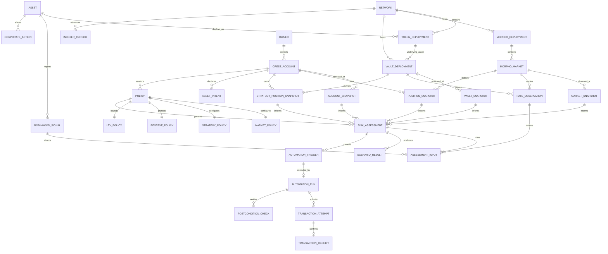

# Crest Entity Relationship Model

**Database:** PostgreSQL
**Onchain authority:** Crest Account, Morpho, and fixed-vault state
**Offchain role:** versioned observations, deterministic assessments, Guardian coordination, and audit history

## 1. Data ownership

- Canonical contract configuration is authoritative after confirmation.
- Morpho/vault state is block-scoped; no mutable row is “current truth.”
- Rate and Robinhood data is timestamped advisory evidence.
- A policy is a versioned mirror of signed intent and confirmed events.
- Every assessment references the exact inputs used.
- Every Guardian run is append-only and ends in explicit postconditions.
- Projected economics and realized debt repayment use different entities/fields.

## 2. ERD



## 3. Identity and registry

### `network`

| Column | Type | Meaning |
|---|---|---|
| `chain_id` | `bigint` | PK; expected Robinhood mainnet `4663`, runtime-verified |
| `slug` | `text` | UNIQUE |
| `name` | `text` | Display |
| `native_symbol` | `text` | Gas display |
| `confirmation_depth` | `integer` | Operational finality |
| `enabled` | `boolean` | Listing/kill switch |

### `asset`

| Column | Type | Meaning |
|---|---|---|
| `id` | `uuid` | PK |
| `provider_uid` | `bytea` | Robinhood UID, nullable for other assets |
| `canonical_symbol` | `text` | Curated display |
| `kind` | `text` | `stock_token/crypto/stablecoin/vault_share` |
| `underlying_symbol` | `text` | Nullable |
| `jurisdiction_note_version` | `text` | Disclosure version |
| `metadata_json` | `jsonb` | Validated metadata |

Ticker is never onchain identity.

### `token_deployment`

`id`, `asset_id`, `chain_id`, `address`, `decimals`, `code_hash`, `source_url`, verification block/hash/time, and status.

UNIQUE `(chain_id,address)` and one active verified deployment per `(asset_id,chain_id)`.

### `morpho_deployment`

`id`, `chain_id`, `address`, `code_hash`, `version`, `source_url`, verification block/hash/time, status. UNIQUE `(chain_id,address)`.

### `morpho_market`

| Column | Type | Meaning |
|---|---|---|
| `id` | `bytea` | PK, derived 32-byte market ID |
| `morpho_deployment_id` | `uuid` | FK |
| `loan_token_id` | `uuid` | FK deployment |
| `collateral_token_id` | `uuid` | FK deployment |
| `oracle_address` | `bytea` | Exact parameter |
| `irm_address` | `bytea` | Exact parameter |
| `lltv_wad` | `numeric(78,0)` | Exact WAD |
| `params_hash_verified` | `boolean` | Derived-ID check |
| `status` | `text` | Route classification |
| `status_reason_codes` | `text[]` | Stable reasons |
| `verified_at` | `timestamptz` | Gate time |

CHECK `0 < lltv_wad <= 1e18`.

### `vault_deployment`

| Column | Type | Meaning |
|---|---|---|
| `id` | `uuid` | PK |
| `chain_id` | `bigint` | FK |
| `address` | `bytea` | UNIQUE with chain |
| `asset_token_id` | `uuid` | FK; must match selected loan token |
| `share_decimals` | `smallint` | Exact |
| `interface_kind` | `text` | `erc4626/fixed_adapter` |
| `adapter_address` | `bytea` | Nullable fixed adapter |
| `code_hash` | `bytea` | Verification |
| `upgradeability_kind` | `text` | Authority disclosure |
| `manager_json` | `jsonb` | Validated role/curator metadata |
| `source_url` | `text` | Official source |
| verification block/hash/time | — | Evidence |
| `status` | `text` | `candidate/verified/degraded/unsupported` |
| `reason_codes` | `text[]` | Gate result |

## 4. Block-scoped observations

Every onchain snapshot includes `chain_id`, `block_number`, `block_hash`, `block_time`, `canonical`, `observed_at`, and non-secret `provider_key`.

### `market_snapshot`

- market ID;
- total supply/borrow assets and shares;
- available loan liquidity;
- borrow/supply rate with exact scale/source;
- oracle raw value, scale, update, and status;
- sequencer status;
- route classification and reasons.

UNIQUE `(market_id,block_hash)`.

### `vault_snapshot`

| Column | Type | Meaning |
|---|---|---|
| `id` | `uuid` | PK |
| `vault_deployment_id` | `uuid` | FK |
| `total_assets` | `numeric(78,0)` | Reported vault assets |
| `total_supply_shares` | `numeric(78,0)` | Share supply |
| `max_deposit_assets` | `numeric(78,0)` | Current account-context cap when applicable |
| `max_withdraw_assets` | `numeric(78,0)` | Current Crest Account withdrawal bound |
| `preview_redeem_assets` | `numeric(78,0)` | Quoted value of observed shares |
| `pause_status` | `text` | Normal/degraded |
| `downstream_json` | `jsonb` | Validated allocations/concentration |
| `reason_codes` | `text[]` | Liquidity/loss/pause reasons |
| common block fields | — | Exact observation |

UNIQUE `(vault_deployment_id,block_hash)`.

### `crest_account`

Registry: `id`, chain/address UNIQUE, owner, deployment transaction/block, contract version/code hash, indexed policy nonce, and status.

### `account_snapshot`

- account ID;
- owner and Guardian;
- market ID and vault deployment ID;
- collateral/debt/strategy caps;
- reserve and strategy floors;
- repayment cap;
- lower/target/upper/critical LTV;
- borrowing freeze and policy nonce;
- raw loan/collateral token and vault-share balances;
- common block fields.

### `position_snapshot`

| Column | Type | Meaning |
|---|---|---|
| `id` | `uuid` | PK |
| `crest_account_id` | `uuid` | FK |
| `market_id` | `bytea` | FK |
| `borrow_shares` | `numeric(78,0)` | Raw |
| `borrow_assets_up` | `numeric(78,0)` | Accrued rounded-up debt |
| `collateral_assets` | `numeric(78,0)` | Raw units |
| `collateral_value` | `numeric(78,0)` | Explicit scale |
| `ltv_wad` | `numeric(78,0)` | Nullable no debt |
| `morpho_health_wad` | `numeric(78,0)` | Nullable no debt |
| common block fields | — | Exact observation |

UNIQUE `(crest_account_id,market_id,block_hash)`.

### `strategy_position_snapshot`

| Column | Type | Meaning |
|---|---|---|
| `id` | `uuid` | PK |
| `crest_account_id` | `uuid` | FK |
| `vault_deployment_id` | `uuid` | FK |
| `share_balance` | `numeric(78,0)` | Raw shares |
| `quoted_assets` | `numeric(78,0)` | `convertToAssets`/adapter quote |
| `max_withdrawable_assets` | `numeric(78,0)` | Current liquidity bound |
| `strategy_floor_assets` | `numeric(78,0)` | Active policy |
| `actionable_assets` | `numeric(78,0)` | After floor/cap bounds |
| common block fields | — | Exact observation |

UNIQUE `(crest_account_id,vault_deployment_id,block_hash)`.

## 5. Advisory observations

### `robinhood_signal`

`id`, asset, kind, stable source ID, provider generation time, fetch time, expiry, status, validated payload, payload hash, and reason codes.

Kinds: `asset_status`, `underlying_price`, `halt`, `multiplier`.

### `corporate_action`

Provider action ID, asset, type/status, documented process fields, source/fetch times, validated details, payload hash, first/last seen.

### `rate_observation`

| Column | Type | Meaning |
|---|---|---|
| `id` | `uuid` | PK |
| `subject_kind` | `text` | `morpho_borrow/vault_base/incentive` |
| `market_id` or `vault_id` | FK | Exactly one subject |
| `rate_value` | `numeric(78,0)` | Integer scaled |
| `rate_scale` | `numeric(78,0)` | Explicit denominator |
| `period_kind` | `text` | APR/APY and compounding convention |
| `gross_or_net` | `text` | Fee meaning |
| `source_url` | `text` | Provider |
| `source_generated_at` | `timestamptz` | Nullable |
| `fetched_at` / `expires_at` | `timestamptz` | Freshness |
| `status` | `text` | `normal/degraded/unknown` |
| `reason_codes` | `text[]` | Stable reasons |

No rate row is called “realized.”

## 6. Owner, intent, and policy

### `owner`

`id`, address UNIQUE, first/last seen. No private key or unnecessary identity.

### `asset_intent`

Append-only owner choices:

- owner/account and token deployment;
- intent `KEEP/PROTECT_AND_BORROW/EARN_STABLE/EARN_ASSET/UNSUPPORTED`;
- route market/vault nullable as appropriate;
- policy version;
- reason codes;
- created/effective time.

`KEEP` and `UNSUPPORTED` cannot have prepared value-moving calldata.

### `policy`

Append-only confirmed versions:

- account and policy nonce;
- schema version and canonical typed JSON;
- canonical content hash;
- source `manual/llm_import`;
- configuration transaction and effective block/hash;
- status `pending/active/superseded/reorged/rejected`;
- draft/activation times.

UNIQUE `(crest_account_id,policy_nonce)` and `(crest_account_id,content_hash)`.

### `market_policy`

One row per MVP policy: exact market ID, collateral cap, accrued-debt ceiling, enabled.

### `strategy_policy`

One row per MVP policy: fixed vault ID, max strategy assets, strategy floor, minimum net-spread BPS, enabled.

### `reserve_policy`

Loan token, reserve floor, maximum repayment per action.

### `ltv_policy`

Lower, target, upper, critical LTV WAD. CHECK:

```text
0 <= lower < target < upper < critical < market.lltv
```

## 7. Risk, carry, and scenarios

### `risk_assessment`

| Column | Type | Meaning |
|---|---|---|
| `id` | `text` | PK sortable ID |
| account/policy/snapshot refs | FK | Exact inputs |
| `risk_engine_version` | `text` | Reproducibility |
| `status` | `text` | Guardian state |
| `ltv_wad` | `numeric(78,0)` | Nullable no debt |
| `morpho_health_wad` | `numeric(78,0)` | Nullable |
| `policy_health_wad` | `numeric(78,0)` | Nullable |
| `owner_borrow_capacity_assets` | `numeric(78,0)` | Zero when degraded/frozen |
| `repay_capacity_assets` | `numeric(78,0)` | Current bounded capacity |
| `estimated_annual_carry_assets` | `numeric(78,0)` | Signed projected value |
| `estimated_spread_bps` | `integer` | Signed projected ratio |
| `recommended_action` | `text` | `none/owner_borrow/freeze/repay_reserve/repay_strategy/owner_review` |
| `reason_codes` | `text[]` | Stable reasons |
| `canonical_input_hash` | `bytea` | Idempotency |
| create/invalidate fields | — | Audit |

Projected fields never update realized-performance rows.

### `realized_strategy_event`

Canonical event-derived accounting:

- Crest Account and transaction;
- kind `deposit/withdraw/repay`;
- vault shares/assets before and after;
- accrued debt before and after;
- `debt_repaid_assets`;
- attributed fees where measurable;
- block/hash/time and canonical status.

A “self-repayment” claim must point to `debt_repaid_assets > 0`.

### `assessment_input`

Assessment ID, input kind, referenced observation ID, and purpose. Enforce exact reference type.

### `stress_scenario` and `scenario_result`

Versioned scenario configuration with provenance and status `illustrative/calibrated`; result stores stressed collateral/debt/vault-liquidity/health/capacity and reasons.

## 8. Guardian automation

### `automation_trigger`

| Column | Type | Meaning |
|---|---|---|
| `id` | `text` | PK |
| `idempotency_key` | `bytea` | UNIQUE |
| `assessment_id` | `text` | FK |
| `policy_id` | `uuid` | FK |
| `action_kind` | `text` | `freeze/repay_reserve/repay_strategy` |
| `requested_assets` | `numeric(78,0)` | Nullable freeze |
| `status` | `text` | `detected/claimed/superseded/completed/failed` |
| timing/lease/reasons | — | Audit |

### `automation_run`

One run per trigger: state machine status, Guardian address, exact selector, observed policy nonce, pre-state references, timing, failure class, and retry count.

### `transaction_attempt`

Run and attempt number, chain/account/from/to, calldata hash and decoded permitted operation, simulation block/result/gas, nonce, transaction hash, submission status/error.

Never store a private key or raw signature.

### `transaction_receipt`

Attempt ID, canonical block/hash, success/revert, gas, decoded Crest/Morpho/vault events, observed time.

### `postcondition_check`

Kinds:

- `frozen`;
- `debt_decreased`;
- `reserve_floor_held`;
- `strategy_floor_held`;
- `vault_receiver_fixed`;
- `repay_beneficiary_fixed`.

A run is verified only when every required check passes.

## 9. Indexing and reorgs

`indexer_cursor(chain_id,stream_key)` stores last canonical block/hash. Events and cursor update atomically. Reorgs mark affected snapshots/receipts/events reorged and invalidate dependent assessments/triggers without deleting audit history.

## 10. Units

| Value | PostgreSQL | API/TypeScript |
|---|---|---|
| Token amount/share/block | `numeric(78,0)` | decimal string / `bigint` |
| WAD ratio/health/LTV | `numeric(78,0)` | decimal string / `bigint` |
| APY/rate | integer value + explicit scale/convention | branded bigint/rational |
| Address/hash | `bytea` | validated hex |
| Oracle value | integer + explicit scale | bigint pair |
| Timestamp | `timestamptz` | ISO-8601 UTC |

Never store financial numbers as `real` or `double precision`.

## 11. Data constraints

- Active policy nonce and canonical event match.
- Policy market loan token equals policy vault asset.
- LTV ordering is valid and critical LTV is below market LLTV.
- Assessment inputs share account/route and acceptable block/time skew.
- Degraded assessment has owner-borrow capacity `0`.
- Guardian transaction target is Crest Account and selector is one of three permitted methods.
- Strategy repayment requires debt decrease, strategy floor, fixed receiver, and fixed beneficiary checks.
- Reserve repayment requires debt decrease and reserve floor checks.
- Projected carry cannot populate realized debt-repaid fields.
- Reorg invalidation preserves history.

## 12. Privacy and retention

- Public addresses/transactions are public, but associations remain user data.
- Private keys, signatures, secret URLs, and seed phrases are never persisted.
- Natural-language drafts are not retained by default; typed policy is.
- Keep route/policy/intervention evidence while the account is supported.
- Normalized advisory observations plus source/timestamps/hash are required; raw payload retention is optional.
- Provide export and deletion for non-public metadata subject to operational/legal obligations.
